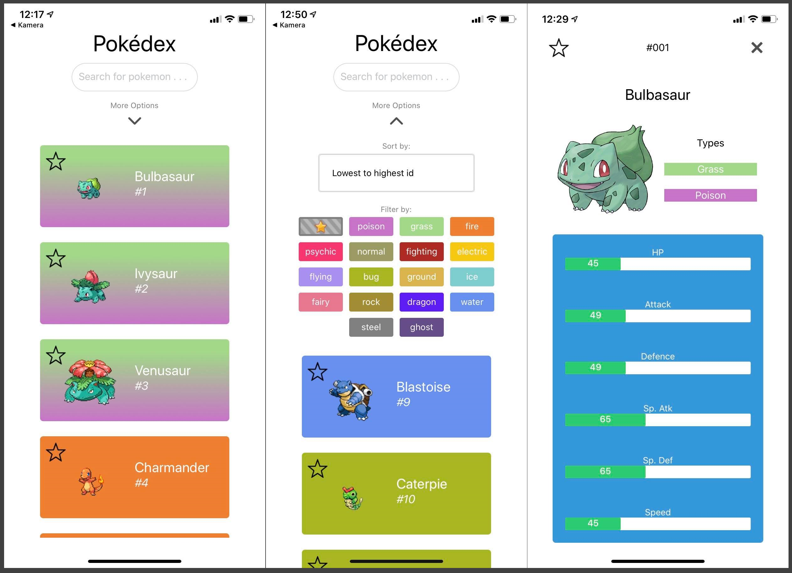
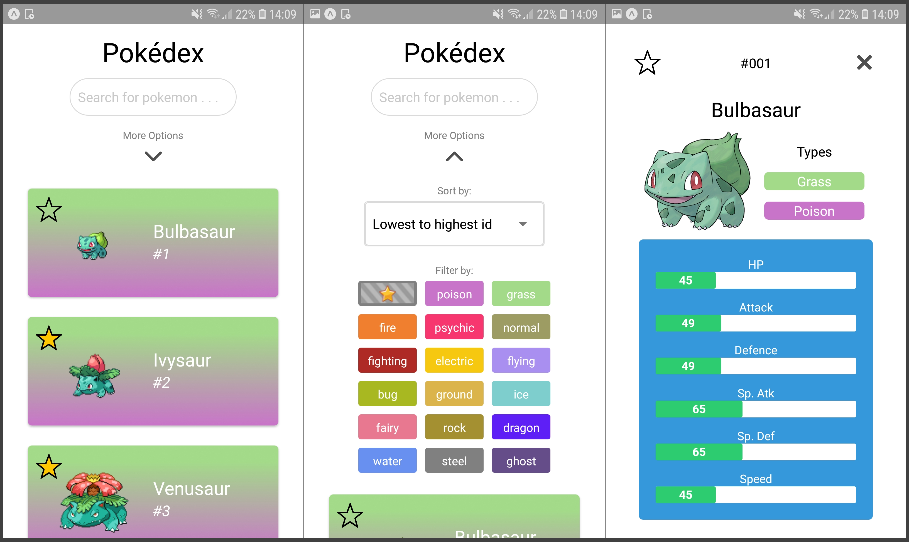

# Introduksjon
Pokédex er en mobilapplikasjon på Android og IOS. Vi valgte å ta utgangspunkt i webapplikasjonen fra prosjekt 3 og valgte derfor samme tema for React Native applikasjonen.  Appen er en katalog for de første 151 pokemonene (altså generasjon 1). På appen kan brukere:
- **se pokemoner i en liste** (med navn og id) og trykke på en av liste-elementene for å få opp en **detaljert visning** av den pokemonen. Den detaljerte visningen viser i tillegg basic statsene til pokemonen.
- **søke etter pokemoner** ved å skrive inn navnet (eller deler av navnet) i søkefeltet. Pokemoner som passer det som har blitt tastet inn vil bli lastet inn etter en liten stund automatisk. Å søke etter kun navn mener vi er intuitivt, da det er navnet brukeren oftest ville søkt etter. I tillegg kan det hende at brukeren bare husker deler av navnet. Derfor vil resultatsettet også bestå av pokemoner som inneholder input-et i navnet sitt.
- **få opp flere muligheter** til blant annet filtrering og sortering ved å trykke på “More Options”. Denne vil automatisk skjules dersom brukeren prøver å scrolle i listen. Dette valget tok vi siden mobilskjermer er små. Dersom vi ikke implementerte dette, ville mye av skjermen vært dekket av ting brukeren ikke alltid trenger å se. Det ville altså vært mindre behagelig å bruke.
- **legge til og fjerne sine favoritt-pokemoner** ved å trykke på stjerne-ikonet ved pokemonen. Denne finner du både i listen med pokemoner og i den detaljerte visningen av en pokemon øverst i venstre hjørne. Dette løsningen finnes i flere apper i ulike former og er naturlig for brukere i dag. I tillegg mente vi denne funksjonaliteten gjorde appen vår nyttigere. For å lagre brukerens favoritt-pokemoner persistent på den mobile enheten brukte vi AsyncStorage. Dette lagrer vi bare som en enkel array med id-ene til favoritt-pokemonene til brukeren.
- **filtrere** etter typer eller favoritter ved å trykke på de ulike knappene under “Filter by:”. Ved å trykke på flere typer vil pokemoner av minst en av de valgte typene vises. Vi mener at det er intuitivt og naturlig å kunne filtrere etter favoritter (og blant disse, typer og navn), ellers ville ikke favoritt-funksjonaliteten vært noe særlig nyttig.
- **sortere etter id og navn** stigende og synkende. Dette gjøres ved å trykke på dropdownen under “Sort by:” og velge ett av alternativene. Dette er to nyttige alternativer som er hensiktsmessig å ha med i en slik applikasjon.
- se flere pokemoner i resultatsettet ved å scrolle i listen. Dersom brukeren kommer helt til bunnen av det som har blitt lastet inn, vil flere pokemoner bli **dynamisk lastet inn**. Dette er for at vi ikke henter unødvendig mye data fra backenden, da brukeren ikke alltid vil se gjennom alle pokemoner.

### Applikasjonen på IOS


### Applikasjonen på Android


# Oppsett og kjøring av prosjektet
1. Klon repo-et med SSH/HTTP i ønsket lokasjon.
2. Skriv `npm install` etterfulgt av `npm start` i terminalen.
3. Scan QR-koden som dukker opp med Expo-mobilappen.

# Teknologi og tredjepartskomponenter
Prosjektet er basert på React Native med Redux. Vi brukte Expo-verktøyet for utvikling av appen.

### React Native pakker:
- Redux + Redux Thunk - brukt for state management
- RNPicker - brukt for å oppnå lik oppførsel for Picker i IOS og Android
- Linear-gradient - brukt til bakgrunnsfargen til pokemonene avhengig av type
- Axios - brukt for å hente data fra endepunkter
- Lodash - brukt for å effektivisere søk og kall til backend

### Backend pakker:
NB! Disse pakkene er ikke nødvendige for å kjøre prosjektet, da backenden til appen kjører på virtuell maskin.
- Cors - brukt for å konfigurere cross-origin resource sharing
- Dotenv - brukt for å skjule sensitiv database informasjon
- Express - brukt for å sette opp REST API
- Mongoose - brukt for objekt modellering i Node.js
- Nodemon - brukt for smidigere utvikling

# Testing
Vi utførte manuell end-to-end testing på IOS og Android enheter for å se om oppførselen for applikasjonen var lik på dem, i tillegg til å forsikre oss om at det ikke var noen åpenbare tekniske feil eller funksjonelle mangler. Dette gjorde vi ved å trykke og skrive inn på de ulike komponentene i appen og se om den oppførte seg som forventet. I tillegg så vi om det kom noen feilmeldinger i Expo-verktøyet. Vi har testet på Samsung S7 Edge og iPhone X.

# Gjenbruksaspektet: React og React Native
Vi valgte å basere appen på prosjekt 3, men la til favoritt-funksjonalitet. Dette førte til at vi kunne gjenbruke mye fra prosjekt 3, men måtte gjøre noen modifikasjoner for å støtte denne nye funksjonaliteten. I tillegg måtte vi gjøre noen endringer for at appen kunne være basert på React Native. Dette var blant annet at React Native ikke renderer HTML-elementer, men heller sine innebygde. Men mye av logikken kunne vi rett og slett kopiere og lime inn i det nye prosjektet. Av ulike grunner nevnt i følgende avsnitt kan vi trygt si at prosjekt 3 var svært gjenbrukbart.

## Redux
Redux ble benyttet for state management i applikasjonen. Gruppen benyttet seg av “Reduck - ducks modular pattern” (https://github.com/erikras/ducks-modular-redux) for å strukturere Redux store. Det går ut på å samle logikken til actions, reducers og action creators i “ducks” som senere blir kombinert i en rootReducer. Vi valgte denne strukturen for å gjøre applikasjonen mer skalerbar. Redux thunk ble benyttet som middleware for å gjøre kall til databasen. 

Fra prosjekt 3 trengte vi kun å utføre små endringer. Vi fjernet views-funksjonaliteten fra appen, og fjernet også dette fra redux. I tillegg la vi til den nye duck-en favoritesDuck for å støtte den nye favoritt-funksjonaliteten. Denne sørger for at favoritt-filtreringsknappen fungerer som forventet. Gjenbruksaspektet her var derfor høyt.

Hver duck var ansvarlig for å styre logikken til en state. I prosjektet vårt ble disse benyttet:

| Duck | Beskrivelse | Action creators |
| ------ | ------ | ------ |
| contentDuck | Styrer om PokemonWordCloud eller PokemonList skal vises til en hver tid. | **showPokemon** sender beskjed til contentReducer slik at gjør at PokemonList vises. **showWordCloud** sender beskjed til contentReducer slik at PokemonWoreCloud vises. 
| modalDuck | Styrer logikken bak åpning og lukking av PokemonModal, samt hvilken pokemon som skal vises. Denne informasjonen er lagret i modalInfo. | **openModal** tar i mot informasjon om pokemonen og videresender dette til reduceren. Deretter blir modalInfo oppdatert. **closeModal** sender beskjed videre til reduceren og fører til at modalen lukkes. |
| pokemonDuck | Styrer logikken til pokemon. Dette innebærer blant annet henting av pokemoner basert på søk, sortering og andre parametere. | **fetchPokemon** er funksjonen som brukes til å hente pokemon fra backenden. Den har flere mulige parametere for å gjøre søk mer spesifikke. Disse verdiene brukes for å strukturere kall til backend, med unntak av loadMore som kun blir benyttet ved innlasting av mer data (ref. load more-knappen). Dataen blir hentet med axios og sendt videre til enten fetchPokemonSuccess ved suksessfulle kall, eller fetchPokemonFailure når feil inntreffer. **fetchPokemonSuccess** tar dataen fra fetchPokemon, legger til loadMore og sender den videre til pokemonReducer. Her blir loadMore brukt til å sjekke nye søkeparametere er lagt til eller om det er innlasting av mer data. **fetchPokemonFailure** inntreffer hvis noe galt skjer i fetchPokemon. Det blir gitt beskjed til pokemonReducer og det blir printet i feilmelding i konsollen. **updateView** brukes til å inkrementere views med en i frontend uten å måtte gjøre et nytt kall til backend for å oppdatere tallet. |
| searchDuck | Oppdaterer søkestrengen til en hver tid. | **updateSearch** sender søkestrengen videre til searchReducer. |
| sortDuck | Bestemmer sorteringslogikken som brukes til å representere/hente pokemon. | **fireAction** tar i mot sortingsdata og videresender hva slags sortering som er valgt av brukeren til sortReducer. |
| typesDuck | Har kontroll på om hvilke pokemon-typer brukeren har valgt å søke på. Søker på ingen ved default. | **updateType** tar i mot hvilke typer som blir trykket og sender det videre til typeReducer. Her blir type staten oppdatert. |
| favoritesDuck | Har kontroll over hvilke pokemoner som skal søkes blant | **fetchFavorites** tar imot en liste med favoritt-pokemoner og lagrer det i favorites staten. **updateFavorites** tar imot en pokemon (som har blitt fjernet eller lagt til i favoritt-pokemoner) og oppdaterer favorites staten. |

## Testing
I prosjekt 3 utførte vi mye testing, både systematisk enhetstesting og automatisert end-to-end testing. Dette gjorde vi ikke i dette prosjektet. Her utførte vi kun manuell end-to-end testing for å forsikre oss over at det ikke var noen åpenbare tekniske feil eller mangler i appen. Men vi kunne fortsatt ta inspirasjon fra testene (fra prosjekt 3) til utførelsen av de manuelle end-to-end testene og hva som burde bli tatt ekstra godt hensyn til.

## Styling
Siden vi implementerte et responsivt design i prosjekt 3, kunne vi ta mye inspirasjon fra det prosjektet. Designet på appen ligner derfor på det i prosjekt 3. Til tross for dette kunne vi ikke bare kopiere og lime inn koden her. Styling i React Native blir ikke gjort gjennom CSS, men heller innebygd kode. Vi måtte derfor kode stylingen fra bunnen av. Mange av attributtene man kunne endre på lignet de man finner i CSS, både i navn og funksjonalitet. Derfor kunne vi oversette mye av CSS-koden fra prosjekt 3 og bruke den ellers som veiledning på hvordan stylingen kunne bli utført. Fortsatt var det noen mangler, blant annet lineær gradient og dropdown (også kalt picker). Disse var ikke innebygd i React Native og måtte importeres inn som et tredjepartskomponent. Det var ikke alltid komponenter så like ut på Android og IOS. Dette måtte vi ta hensyn til og brukte blant annet RNPicker for å sørge for at appen fungerte som ønsket på begge. Alt i alt var gjenbruksaspektet her derfor greit.

## Backend
Vi tok bruk av samme database, men måtte gjøre noen endringer i API-et. Dette er fordi vi ønsket at i appen vår skulle man kunne se sine favoritt-pokemon og filtrere/sortere blant disse. Til tross for dette trengte vi bare å kopiere koden fra sist og gjøre noen små endringer for å få dette til. Vi la til idList query parameteret til det ene hente-endepunktet, i tillegg til å gi det nye API-et en egen adresse. Til slutt fikk vi den kjørende på virtuell maskin på samme måte som sist. For vurderingens skyld lastet vi koden for det nye API-et opp på repository-et (som du finner i `backend`-mappen). Dersom vi ikke ønsket å legge til favoritt-filtrerings/sorterings-funksjonaliteten kunne vi brukt API-et fra sist ved å bruke riktig adresse (til hvor den kjører på den virtuelle maskinen). Gjenbruksaspektet her var derfor høyt.

### Endepunkt

```
GET: http://localhost:8080/api/v2/pokemon/
```

Henter all data om opptil 25 pokemoner. Brukes til sortering, filtrering etter navn, type og favoritt-pokemon og henting av pokemondata (searchbar, filterbuttons, pokemonlist...).

##### Suksess respons

```json
200 OK
[
  {
    "name": String,
    "types": Array,
    "id": String
    "_id": String,
    "stats": Array,
    "views": Number
  }
]
```

| Query parameter | Støttede verdier                                                                                                             | Beskrivelse                                                               | 
| --------------- | ---------------------------------------------------------------------------------------------------------------------------- | ------------------------------------------------------------------------- | 
| skip            | alle positive heltall                                                                                                        | Bestemme hvor mange pokemoner man ønsker å hoppe over.                    | 
| types        | liste med strenger: poison, grass, fire, psychic, normal, fighting, electric, flying, bug, ground, ice, fairy, rock, dragon, water, steel, ghost | Filtrere etter bestemt(e) type(r).                       |
| name            | en streng                                                                                                                    | Spesifisere at man ønsker pokemoner med navn som inneholder angitt verdi. |
| sort            | name, nameDESC, id, idDESC, views, viewsDESC                                                                                 | Sortere pokemonene i enten alfabetisk rekkefølge, etter id eller views.   |
| limit           | none                                                                                                                         | Spesifisere at man ønsker å hente alle pokemoner.                         |
| idList | liste med heltall | Spesifisere hvilke pokemoner man ønsker å filtere/sortere blant |

# Bruk av Git
Vi dekomponerte utviklingen inn i issues på GitLab og jobbet på hver vår branch med navn som samsvarte med det vi jobbet med. I tillegg knyttet vi hver commit til en issue for å sørge for oversiktlighet og god kommunikasjon over GitLab under utviklingen. Vi forholdte oss til korte issue-navn og beskrivelser for å gjøre det mer lettlest. I tillegg så vi gjennom endringene ved merge requests for å gjøre en kvalitetssjekk på koden før merging.

# Inspirasjon
Prosjekt 3: https://gitlab.stud.idi.ntnu.no/IT2810-H19/teams/team-3/it2810-prosjekt3 


